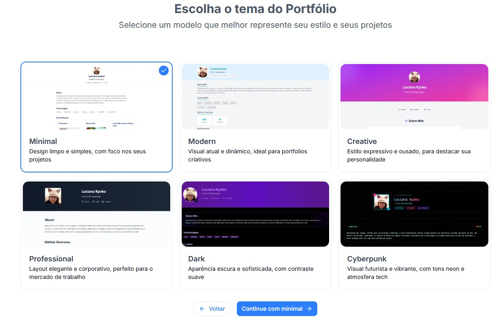

  

  <a src="https://gitfollio.vercel.app/">Acesse a página</a> 

---

GitFollio é uma aplicação web que permite criar portfólios personalizados a partir de dados do GitHub em poucos passos.

Com uma interface intuitiva, os usuários podem configurar seus dados pessoais, selecionar repositórios públicos para exibir como projetos, personalizar informações como imagens, tecnologias e links de deploy, e escolher entre diferentes temas visuais.

Ideal para desenvolvedores que desejam showcasing seus projetos de forma profissional e prática.

---

## ⭐ Funcionalidades

🔹 **Integração com GitHub**: Carrega automaticamente repositórios públicos do usuário, incluindo nome, URL e número de estrelas.

🔹 **Formulário de Personalização**: Permite configurar nome, e-mail, LinkedIn, tagline, site pessoal, seção "Sobre" e tecnologias.

🔹 **Seleção de Projetos**: Escolha quais repositórios exibir, com opções para adicionar descrição personalizada, link da imagem, tecnologias usadas e link de deploy.

🔹 **Destaque de Projetos**: Até 3 projetos podem ser destacados para maior ênfase no portfólio.

🔹 **Temas Visuais**: Escolha entre 6 temas (ex.: Cyberpunk, Creative) para personalizar a aparência do portfólio.

🔹 **API Simples**: Endpoint /api/gitfolio/[user] para buscar configurações do portfólio a partir do README do repositório do usuário.

---

## ⭐ Como Funciona
🔹**Configure o README**: Adicione um bloco GitFollio no README do seu repositório GitHub (ex.: github.com/seu-usuario/seu-usuario).

🔹**Acesse a Aplicação**: Visite gitfollio.vercel.app e insira seu nome de usuário do GitHub.

🔹**Personalize o Portfólio**: Preencha o formulário com suas informações e selecione os projetos desejados.

🔹**Escolha um Tema**: Selecione um dos temas disponíveis para renderizar seu portfólio.

🔹**Visualize e Compartilhe**: Veja a prévia do portfólio e compartilhe o link público.

---

## ⭐ Temas

  

---

## ⭐ Tecnologias Utilizadas

🔹Next.js
🔹React
🔹GitHub API
🔹TypeScript
🔹TailwindCSS
🔹React Query

---

## ⭐ Licença
Este projeto está licenciado sob a MIT License.

Feito com 💖 por Luciana Kyoko.